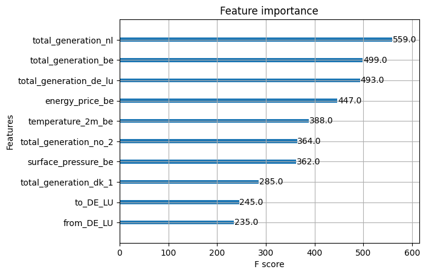

# Netherlands Cross-Border Electricity Flow Prediction

## About 
This project provides an interactive tool to predict, monitor and analyze direction and volume of electricity flows **to and from the Netherlands** and it's energy transmission partners (Germany, Belgium, Great Britain, Denmark, Norway). The project uses a Serverless Machine Learning pipeline to predict the direction and amount of electricity flows based on based on historic data, day-ahead energy prices, and forecasts of electricity generation and weather. 

Developed as part of theFinal Project of the course [ID2223 Scalable Machine Learning and Deep Learning](https://www.kth.se/student/kurser/kurs/ID2223?l=en) at KTH, this project aimed to build and deploy a maintainable Machine Learning system capable of generating and updating daily predictions seamlessly.


## Table of Contents
1. [Architecture and Frameworks](#architecture-and-frameworks)
2. [Pipelines](#pipelines)
3. [Data](#data)
4. [Project Structure](#project-structure)
5. [Results](#results)
6. [Installation and Usage](#installation-and-usage)
7. [Contributors](#contributors)


## Architecture and Frameworks
This project has the following architecture chosen for scalability, automation and userfriendly usage. Key components include:
- **Hopsworks**: used for centralized storage and management of data, models, and metadata. Hopsworks acts as the backbone for storing raw and processed datasets in its **Feature Store**, as well as registering trained models in its **Model Registry**. 
- **GitHub Actions**: automates daily updates by running scheduled workflows for real-time data collection and inference pipelines to generate predictions. 
- **Streamlit**: facilitates interactive dashboards for deployment, enabling users to:
  - Visualize cross-border electricity flows with a dynamic map.
  - Analyze trends with time-series charts.
  - Apply filters and interact with data.
  - Export the daily predictions as `csv`. 

TODO: add diagram 

## Pipelines
For this project, we prioritized clear organization and scalability, structuring it into three distinct pipelines:

### **Feature Pipeline**
The primary goal of the feature pipeline is to acquire and process data efficiently. To accommodate the diverse data requirements for our predictions, we implemented three specialized sub-pipelines:  
- **Backfill Pipeline**: handles the collection and preprocessing of historical data.  
- **Daily Pipeline**: focuses on obtaining and updating the database with new daily data.  
- **Daily Forecast Pipeline**: retrieves and processes forecast data (weather, day-ahead electricity prices and electricity production) from APIs that enhance the prediction accuracy.

All these sub-pipelines follow an ETL (Extract, Transform, Load) approach to ensure data is extracted, processed, and loaded to [Hopsworks](https://www.hopsworks.ai/), our chosen data storage and handler platform. We believe this division improves code clarity by distinguishing the methods for handling historical data, daily updates, and forecast data.  

To maintain up-to-date predictions and data, **GitHub Actions** are configured to automatically run the pipelines daily at 00:00. 

### **Training Pipeline**
The training pipeline is responsible for model training, enabling hyperparameter tuning and experimentation with different features. We designed this pipeline to be versatile, allowing users to fine-tune models and use different groups of features, as wished. 

For more details on how to use the training pipeline, you can consult the parser by running:  
```bash
python training_pipeline/train.py -h
```  

Further details about the training process and results can be found in the [Results](#results) section. Although the pipeline supports scheduling to automatically retrain models with new data, this functionality was not implemented in this project and remains open for future work.


### **Inference Pipeline**
The inference pipeline generates daily predictions for electricity flows. It interacts with the feature pipeline to extract and preprocess forecast data, uses the pre-trained model to make predictions, and stores the results.  The predictions are saved both in **Hopsworks** as a feature group named `predictions` and as a `.csv` file in this repository under `inference_pipeline/predictions/`.  


## Data
The data used in this project comes from two primary sources: **ENTSO-E** and **Open-Meteo**.

### **ENTSO-E Transparency Platform**
ENTSO-E provides comprehensive energy market and system data, which we accessed using the [entsoe-py](https://github.com/EnergieID/entsoe-py) Python library. This library offers a user-friendly way to query and retrieve energy-related data. The specific data we used from ENTSO-E includes:  
- **Day-Ahead Prices**: energy market prices forecasted a day in advance.  
- **Cross-Border Flows**: historical electricity flow data between the Netherlands and its energy transmission partners.  
- **Energy Generation (Historical)**: data on past electricity production by energy type (wind, solar, fossil oil, nuclear, biomass, hydro, etc.).  
- **Energy Generation Forecasts**: predictions of future electricity generation.

### **Open-Meteo**
To account for the growing reliance on sustainable energy sources and the influence of environmental conditions on energy production, we incorporated weather data into our predictions. By integrating this data, we aimed to capture the factors that directly impact renewable energy generation. Specifically, we focused on obtaining weather variables relevant to the following energy types:  

- **Solar Energy**:  
  - `temperature_2m`  
  - `cloudcover`  
  - `direct_radiation`  
  - `diffuse_radiation`  

- **Wind Energy**:  
  - `surface_pressure`  
  - `wind_speed_10m`, `wind_direction_10m`  
  - `wind_speed_100m`, `wind_direction_100m`  

- **Hydro Energy**:  
  - `precipitation`  
  - `snow_depth`  

These variables were obtained using the [Open-Meteo](https://open-meteo.com/) platform, which provides free weather data, both historical and also forecasted.


## Results  

### **Graphical User Interface**  
Our [interactive interface](https://nl-cross-border-electricity-flow-prediction.streamlit.app/) offers an engaging way to explore the project results. With three intuitive tabs, you can:  
- **Visualize Energy Flows:** Dive into the **Energy Flow Map** to observe electricity transfers between the Netherlands and its neighboring countries. Color-coded arcs represent the direction of the flow, providing a clear and dynamic visualization.  
- **Analyze Trends:** Use the **Time-Series Analysis** tab to explore patterns in energy flows, prices, and total energy generation over time. This enables deeper insights into market behaviors and energy dynamics.  
- **View and Export Tabular Data:** Navigate to the **Tabular Format** section to inspect detailed predictions and download the data for further analysis.

### **Model Performance**  
We chose [XGBoost](https://xgboost.readthedocs.io/en/stable/index.html) for its balance of performance and computational efficiency. The model was trained using two strategies:  
1. **All Energy Features:** Leveraging detailed data on energy production types, including wind, solar, fossil oil, nuclear, biomass, hydro, etc.  
2. **Aggregated Energy Features:** Using only the total energy produced per country, without distinguishing by production type.  

Additionally, we performed a grid search to optimize hyperparameters, including `n_estimators`, `max_depth`, `learning_rate`, `subsample`, and `colsample_bytree`. The best-performing configuration was:  
- **n_estimators:** 100  
- **max_depth:** 6  
- **learning_rate:** 0.3  
- **subsample:** 1  

This configuration was applied to the model trained only on total energy produced per country, with the objective of minimizing squared error. The model was trained on data from 2018 to 2024 and tested on one year of data from 2024. The key results include:  
- **R-squared:** 0.4805  
- **Mean Squared Error (MSE):** 221547  

The most significant features can be seen next:  



### **Future Work**  
The project provides a starting point for building scalable and dynamic systems to analyze electricity flows. Future improvements could include:  
- Expanding the feature set and exploring alternative models to enhance predictive performance.  
- Automating the training pipeline to periodically update the model with new data.  
- Extending the geographical scope to include more countries and cross-border electricity flows, creating a broader and more impactful analysis.  


## Project Structure 
You can navigate the project using the following directory structure as a guide: 

```
├── app.py                   # Streamlit application script
├── requirements.txt         # Python dependencies
├── README.md  
├── models/                  # Storage of the trained models and results
├── github/workflows         # Github Actions              
├── utils/                   # Utility modules
│   ├── data.py              # Related to handling of the data
│   ├── utils.py             # General helper functions 
│   └── settings.py          # Environment variables and configuration
├── feature_pipeline/        # Data acquisition and processing pipelines
│   ├── ETL/                 # Functions groupped as extract, transform and load
│   └── pipeline.py          # Daily data extractions
├── training_pipeline/       # Model training components
│   └──  train.py            # Model training script
└── inference_pipeline/      # Prediction generation components
    ├── inference.py         # Inference script for generating predictions
    └── predictions/         # Directory for storing prediction results
```
 
## Installation and Usage  
To extract data and interact with the required services, you will need API keys for both ENTSO-E and Hopsworks. These keys must be stored in a `.env` file located in the project's root directory with the following variable names: `EntsoePandasClient` and `HOPSWORKS_API_KEY` 

TODO: eric check 

### Setup  
1. Clone this repository:  
   ```bash
   git clone https://github.com/yourusername/netherlands-energy-flow-prediction.git
   cd netherlands-energy-flow-prediction
   ```  

2. Install the required dependencies:  
   ```bash
   pip install -r requirements.txt
   ```  

3. Create a `.env` file in the root directory and add your API keys:  
   ```plaintext
   EntsoePandasClient=your_entsoe_key
   HOPSWORKS_API_KEY=your_hopsworks_key
   ```  

4. Run the Streamlit app:  
   ```bash
   streamlit run app.py
   ```  

## Usage
1. Launch the app using Streamlit or open ours [here](https://nl-cross-border-electricity-flow-prediction.streamlit.app/). 
2. Use the sidebar to filter by date, hour, and energy flow type (Export, Import, or All which is both).
3. Explore the following tabs:
   - **Energy Flow Map:** visualize electricity flows between countries.
   - **Time-Series Analysis:** analyze trends in energy transfer, prices, and generation.
   - **Tabular Format:** view and export the predictions in a tabular format.
--- 

## Contributors
- **Eric Banzuzi**
- **Rosamelia Carioni** 

---